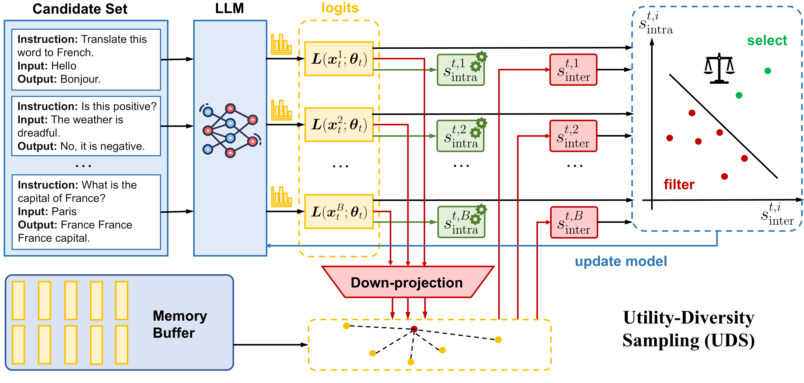

# Utility-Diversity Aware Online Batch Selection for LLM Supervised Fine-tuning

This repository contains the official implementation of our paper:
**"Utility-Diversity Aware Online Batch Selection for LLM Supervised Fine-tuning."**



## 🧠 Abstract

Supervised fine-tuning (SFT) is a commonly used technique to adapt large language models (LLMs) to downstream tasks. In practice, SFT on a full dataset is computationally expensive and sometimes suffers from overfitting or bias amplification. This facilitates the rise of data curation in SFT, which prioritizes the most valuable data to optimze. This work studies the online batch selection family that dynamically scores and filters samples during the training process. However, existing popular methods often (i) rely merely on the utility of data to select a subset while neglecting other crucial factors like diversity, (ii) rely on external resources such as reference models or validation sets, and (iii) incur extra training time over full-dataset training. To address these limitations, this work develops \textbf{UDS (Utility-Diversity Sampling)}, a framework for efficient online batch selection in SFT. UDS leverages the nuclear norm of the logits matrix to capture both data utility and intra-sample diversity, while estimating inter-sample diversity through efficient low-dimensional embedding comparisons with a lightweight memory buffer of historical samples. Such a design eliminates the need for external resources and unnecessary backpropagation, securing computational efficiency. Experiments on multiple benchmarks demonstrate that UDS consistently outperforms state-of-the-art online batch selection methods under varying data budgets, and significantly reduces training time compared to full-dataset fine-tuning.

## ⚙️ Environment Setup

We recommend using Miniconda to create a clean environment:

```bash
conda create -n UDS python=3.9
conda activate UDS
pip install -r requirements.txt
```

## 🚀 Running Experiments

We provide example scripts for training and evaluating the Qwen-2.5-7B model on the MMLU benchmark using only 12.5% of the training data.
```bash
cd scripts
./run_mmlu.sh         # training and evaluation
```

## 📬 Contact

If you have any questions or feedback, please feel free to reach out:  
📧 [zouhm24@mails.tsinghua.edu.cn](mailto:zouhm24@mails.tsinghua.edu.cn)